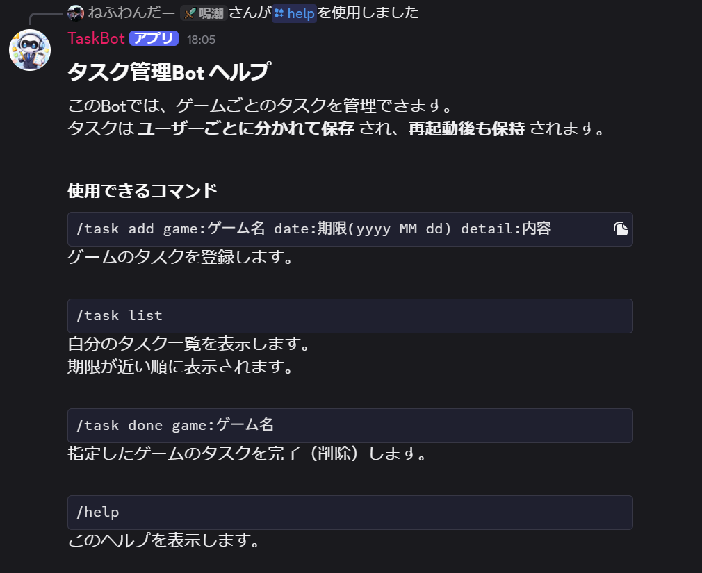
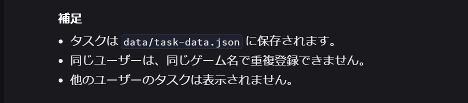
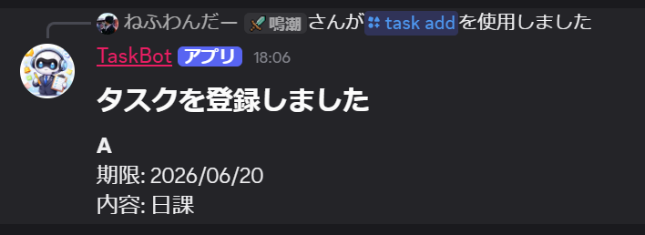
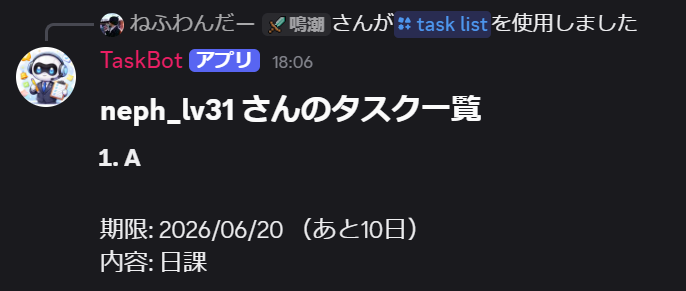
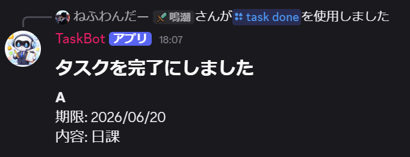
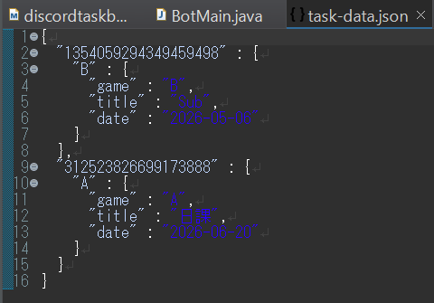

# Discord Task Bot

Discord上でタスク管理を行うJava製のDiscord Botです。

JDA（Java Discord API）を利用して開発しており、スラッシュコマンドによるタスク登録・一覧表示・削除に対応しています。

登録されたタスクはJSONファイルへ保存されるため、Botを再起動してもデータが保持されます。

本プロジェクトは、Javaによるアプリケーション開発、外部ライブラリの利用、データ永続化処理の理解を深めることを目的として作成したポートフォリオです。

---

# 動作デモ動画

実際の動作動画（YouTube限定公開）

▶ 動画はこちら

[https://www.youtube.com/watch?v=YOUR_VIDEO_URL](https://youtu.be/pv5xcW6yaeo)

### 動画で確認できる内容

* Bot起動
* `/help`
* `/task add`
* `/task list`
* Bot停止
* JSON保存確認
* Bot再起動
* データ保持確認
* `/task done`
* タスク削除確認

---

# 使用技術

* Java
* JDA (Java Discord API)
* Maven
* Jackson
* JSON
* Eclipse
* Git
* GitHub

---

# 主な機能

* `/help`

  * コマンド一覧を表示

* `/task add`

  * タスクを登録

* `/task list`

  * タスク一覧を表示
  * 期限順表示
  * 残り日数表示
  * 期限切れ判定

* `/task done`

  * タスクを削除

* JSON永続化

  * Bot再起動後もデータを保持

* ユーザーごとのタスク分離

* JSON破損時のエラーハンドリング

* ConfigLoaderによるToken管理

---

# スクリーンショット

## /help

利用可能なコマンド一覧を表示します。

### ヘルプ画面（上部）



### ヘルプ画面（下部）



---

## /task add



---

## /task list



---

## /task done



---

## JSON保存データ



---

# システム構成

```text
Discord
    ↓
Slash Command
    ↓
TaskCommandListener
    ↓
TaskStore
    ↓
task-data.json
```

---

# クラス構成

```text
BotMain
 ├─ ConfigLoader
 ├─ HelpCommandListener
 ├─ TaskCommandListener
 ├─ Task
 └─ TaskStore
```

---

# 工夫した点

## ユーザーごとのタスク管理

DiscordユーザーIDごとにタスクデータを管理し、他ユーザーのタスクが表示されないようにしています。

---

## JSONによる永続化

登録されたタスクはJSONファイルへ保存されます。

Bot停止後もデータが保持され、再起動後も継続して利用できます。

---

## JSON破損時のエラーハンドリング

JSONファイルが破損していた場合でもBot全体が異常終了しないようにし、空データとして起動できるよう実装しています。

---

## ConfigLoaderによるToken管理

Discord Bot Tokenはソースコードへ直接記述していません。

設定ファイルから読み込む構成とすることで、機密情報がソースコードへ含まれないようにしています。

---

# データ保存について

保存先

```text
data/task-data.json
```

保存データ例

```json
{
  "123456789012345678": {
    "GameA": {
      "game": "GameA",
      "title": "Daily Mission",
      "date": "2026-06-20"
    }
  }
}
```

---

# セットアップ方法

## 1. リポジトリを取得

GitHubから本リポジトリをCloneまたはDownloadしてください。

```bash
git clone https://github.com/your-account/DiscordTaskBot.git
```

---

## 2. config.properties を作成

本リポジトリには実際のTokenを含む設定ファイルは公開していません。

公開しているサンプルファイル

```text
src/main/resources/config.properties.example
```

こちらを参考に、

```text
src/main/resources/config.properties
```

を作成してください。

内容例

```properties
discord.token=YOUR_DISCORD_BOT_TOKEN
```

---

## 3. Discord Bot Tokenを設定

Discord Developer PortalでBotを作成し、取得したTokenを設定してください。

---

## 4. Maven依存関係を取得

Mavenプロジェクトとしてインポートしてください。

---

## 5. Botを起動

```text
BotMain.java
```

を実行してください。

---

# セキュリティについて

Discord Bot Tokenの漏洩防止のため、以下のファイルはGitHubへ公開していません。

```text
config.properties
```

代わりに以下を公開しています。

```text
config.properties.example
```

利用者は自身の環境で `config.properties` を作成する必要があります。

---

# 今後の改善予定

* 1ゲームに複数タスク登録対応
* SQLite対応
* タスク共有機能
* 期限通知機能
* OCRによる画像からのタスク登録

---

# 開発目的

本プロジェクトでは以下の技術習得を目的としました。

* Javaによるオブジェクト指向開発
* JDAを利用したDiscord Bot開発
* JSONによるデータ永続化
* 例外処理
* Mavenによる依存関係管理
* Git / GitHubによるバージョン管理
* 設定ファイルを利用した機密情報管理
